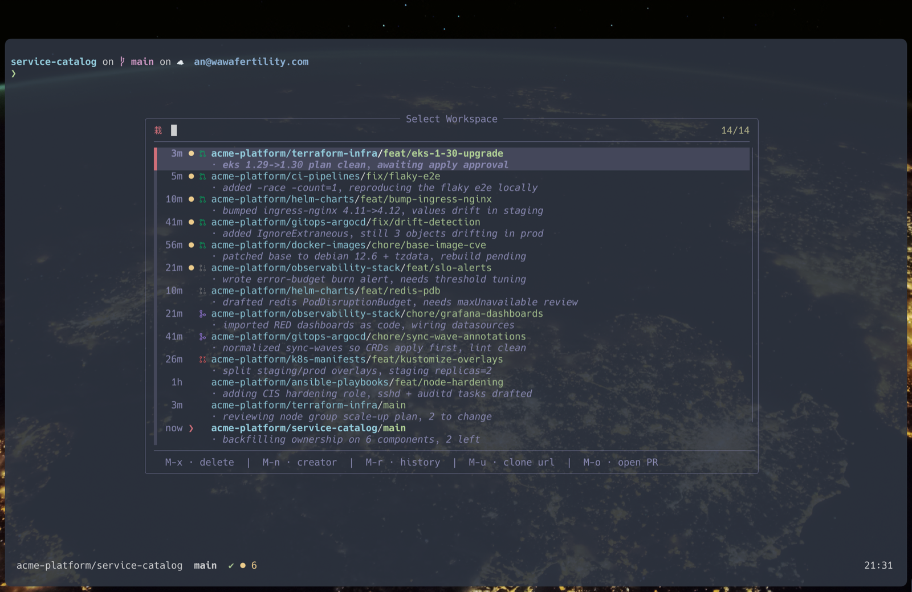

<div align="center">

# atelier

**tmux + git-worktree workspaces for running coding agents in parallel.**

One Go binary, curated built-in tools, an unopinionated statusline API.

[](https://github.com/vyrwu/atelier/actions/workflows/ci.yml)
[](https://github.com/vyrwu/atelier/releases)
[](LICENSE)



<!-- TODO: replace this splash with a demo video showcasing atelier. -->

</div>

> [!NOTE]
> Alpha, single-author project. Stable for the author's daily use; expect
> rough edges. macOS is the daily-driver platform; Linux builds exist but
> are not exercised as hard.

---

## Overview

atelier manages tmux windows, git worktrees, and per-workspace tool state so
you can run several coding agents (Claude Code, Codex, Aider) in parallel and
keep track of which ones need attention.

A workspace is one tmux window + one git worktree + its own tool state — agent
session, lazygit, k9s context, postgres CLI. The engine tracks recap text,
attention flags, and git freshness per workspace, persists them to disk, and
rehydrates on tmux restart.

## Features

- **Workspace = window + worktree + tool state.** `M-n` creates a workspace
  from a natural-language task, `M-s` switches between them, `M-;` opens any
  tool for the current workspace, `M-r` recovers one that was soft-closed.
- **Load-bearing kernel, swappable integrations.** The kernel owns the views
  and their capability slots — a per-row AI summary, an attention sigil, a
  code-forge badge. An integration is a bounded adapter that fills a slot.
  Claude is the default AI; GitHub fills the PR badge. Both are selected in
  config, not compiled in.
- **Launchers instead of an SDK.** Register any command with a `[tools.<name>]`
  block; atelier binds a key, opens it in a popup, and owns the window state.
  No Go, no plugin protocol, no recompile.
- **Unopinionated statusline.** atelier emits git freshness (ahead/behind) and
  attention (agent finished while you were elsewhere) as `#(atelier status …)`
  commands you embed in your own statusline. Works with vanilla tmux, Dracula,
  or Powerline; it supplies data, not visuals.
- **Persistent state.** Workspaces, recap text, attention flags, and git
  freshness are written through to disk. `M-q` detaches while the server keeps
  running, so background agents survive.
- **Always-on diagnostics.** Every tmux call from every atelier process is
  logged to `~/.cache/atelier/debug.log`. `atelier doctor` reports missing
  dependencies.

## Installation

```bash
brew install vyrwu/tap/atelier
```

The cask pulls in the two hard dependencies, `tmux` and `fzf`. Everything else
(k9s, pgcli, lazygit, gh, aws-vault, node, …) is optional — install only what
the tools you use require. `atelier doctor` reports the gaps.

<details>
<summary>Build from source</summary>

```bash
git clone https://github.com/vyrwu/atelier
cd atelier
make install        # builds and installs to $HOME/.local/bin
```

A Nix dev shell (`nix develop`) pins tmux, go, fzf, jq, yq, golangci-lint, and
goreleaser.

</details>

<details>
<summary>Prebuilt binaries</summary>

Download a tarball for linux/macos × amd64/arm64 from the
[releases page](https://github.com/vyrwu/atelier/releases) and place the
`atelier` binary on your `PATH`.

</details>

## Get started

Add one line to `~/.config/tmux/tmux.conf`:

```tmux
run-shell 'atelier init --bare | tmux source-file -'
```

`--bare` emits engine wiring only — bindings, hooks, and statusline data
emitters — with no theme or format opinions, so an existing dracula / gruvbox /
nord setup is unaffected. This is the author's daily driver; see
[`examples/tmux/vyrwu.conf`](examples/tmux/vyrwu.conf) (dracula + TPM + atelier).

```bash
atelier doctor      # check tmux and every tool's requirements
```

For wiring freshness and attention into your statusline format, see
[docs/EMBEDDING.md](docs/EMBEDDING.md).

<details>
<summary>Reference tmux configs</summary>

| File | Description |
|---|---|
| [`examples/tmux/minimal.conf`](examples/tmux/minimal.conf) | atelier on vanilla tmux — no theme, no plugins. The smallest embedding. |
| [`examples/tmux/powerline.conf`](examples/tmux/powerline.conf) | atelier in a powerline-styled tmux; shows how emitters inject into arrow-segment layouts. |
| [`examples/tmux/vyrwu.conf`](examples/tmux/vyrwu.conf) | The author's daily-driver config: dracula + TPM + atelier. |

The only load-bearing line is the `run-shell` above; the rest is taste.

</details>

<details>
<summary>Bundled runtime (no existing tmux setup)</summary>

Run `atelier` with no subcommand to spawn a dedicated tmux server
(`tmux -L atelier`) with curated defaults — system-clipboard yank, 50k
scrollback, focus-events, vi mode, truecolor, fast escape-time. No `tmux.conf`
required.

```bash
atelier
```

Override defaults in `~/.config/atelier/tmux.conf.local` (sourced after every
default). For powerline decoration, start from
[`examples/atelier-extras.tmux`](examples/atelier-extras.tmux) (requires a Nerd
Font).

</details>

## Key bindings

| Keys | Action |
|------|--------|
| `M-;` | Tool selector — fzf list of every discovered tool; picks route to the current workspace. |
| `M-n` | New workspace — natural-language task → Claude names the branch → worktree + agent session. |
| `M-s` | Select workspace — switch between workspaces (recap + git freshness per row). |
| `M-r` | Recover workspace — recently soft-closed workspaces rank to the top; recover or delete. |
| `M-?` | Cheatsheet — every active binding, scoped to the current context. |
| `M-q` | Detach — the server keeps running; reattach with `atelier` (or `tmux -L atelier attach`). |

Each popup runs in its own backing tmux session, so opening a tool does not
disturb your work and closing it leaves it ready to resume. `M-;` works inside a
tool's popup, so you can pivot to another tool without closing the first.

## Configuration

Config is optional — every field has a default, and atelier runs with no config
file at all. There is no scaffold command yet; to override, hand-write
`$XDG_CONFIG_HOME/atelier/config.toml` (`~/.config/atelier/config.toml`). Each
section is loaded independently, so you only include the sections you change.
`~`, `~/…`, and `$VAR` are expanded in path values.

The block below is the complete schema, showing every option at its default:

```toml
[integrations]
ai    = "claude"   # AI adapter: "claude" | "mock" | "" (disables AI features)
forge = ""         # forge/PR-badge adapter: "github" | "" (off)

[workspaces]
code_root       = "~/code/github"             # where M-n clones single repos
worktree_root   = "~/code/.worktrees/github"  # where M-n creates git worktrees
multi_repo_root = "~/code"                     # root for multi-repo workspaces
name_gen_model  = "haiku"                      # Claude model that names branches (M-n)

[k8s]
contexts = "~/.config/atelier/k8s/contexts.yaml"  # k9s context definitions
configs  = "~/.config/atelier/k8s/configs.yaml"   # k9s cluster configs

[pg]
contexts = "~/.config/atelier/pg/contexts.yaml"   # postgres endpoint definitions

# Only when [integrations] ai = "claude". Empty prompt = built-in default.
[claude]
recap_model              = "haiku"   # model for one-line session recaps (M-s rows)
recap_system_prompt      = ""         # override the recap prompt
multi_repo_system_prompt = ""         # extra system prompt in multi-repo workspaces

# [tools.<name>] launcher blocks register arbitrary TUIs in popups —
# see "Extending atelier" for every field.
```

## Extending atelier

Three mechanisms, by what you are adding.

### 1. A launcher (no code)

Register any TUI with a `[tools.<name>]` block. atelier binds the key, opens
the command in a popup of the declared shape, and owns the window state; the
command need not be an atelier binary. Example — k9s authenticated through AWS
SSO first:

```toml
[tools.k9s-aws]
launch       = "aws-vault-k9s"   # REQUIRED — any executable on PATH (a script you wrote)
popup        = "global"          # workspace | global | none  (default: none)
key          = "K"               # optional tmux binding
key_table    = ""                # optional tmux key-table for the binding (default: root)
requires     = ["aws-vault-k9s"] # atelier doctor checks these
invoke       = "open"            # manifest invoke verb (default: open)
start_cwd    = true              # start in the workspace cwd (default: true iff popup="workspace")
icon         = "胡"
accent_color = "110"             # tmux colour 0–255
title        = "K9s (AWS)"
description  = "k9s with AWS SSO auth"
```

`atelier tools list` shows it, `atelier doctor` checks its `requires`, and `M-;`
lists it in the selector.

### 2. An integration (swap a capability)

To change which component fills a kernel capability — the AI that names
branches, summarizes, and raises attention, or the forge behind the PR badge —
write an adapter satisfying the kernel port (`internal/integration`:
`AIIntegration`, `ForgeIntegration`) and select it in config:

```toml
[integrations]
ai    = "claude"
forge = "github"
```

Bundled adapters live in `internal/adapters/{claude,github,mock}`. Adding
`codex` / `gemini` / `gitlab` is a new adapter implementing the same port plus
one line in the composition root (`cmd/atelier/integrations.go`). The kernel
does not change; it drives whatever adapter is installed.

### 3. A built-in tool (a PR)

Tools with pre-launch logic (k8s / pg / aws context and auth pickers) are Go
packages under `internal/tools/<name>` exposing `Manifest` + `AddCommands`,
registered in `internal/tools/all`, and dispatched via `atelier tools <name>`.
See [CONTRIBUTING.md](CONTRIBUTING.md).

## How it works

```
[ workspace = tmux window backed by a git worktree ]
        │
        │  bind c → set @atelier_outer_pane=$5
        │       → display-popup -E 'atelier ai open'
        ▼
[ claude popup session (_atelier_claude_5_3) ]
        │
        │  reads @atelier_outer_pane → knows outer is $5
        │  M-; opens tool selector, which can spawn other tools
        │  on the same outer pane without closing claude
        ▼
[ k8s popup renders on $5, claude popup stays open ]
```

The engine tracks the outer pane in global tmux options. Tools inside popups
read those globals — no parsing of session names, no guessing about ancestry.
Each popup spawns its own `atelier` process (one binary, one process per popup),
so a crash in one tool cannot take down the others. Full architecture in
[DESIGN.md](DESIGN.md).

## Development

```bash
make build           # build the atelier binary into bin/
make test            # unit tests (no tmux required)
make test-e2e        # e2e tests against isolated tmux servers
make test-tmux       # launch a sandboxed tmux server with the current build
```

E2E tests spin up `tmux -L atelier-test-<random>` servers, isolated from your
real tmux; cleanup runs even on panic. Every bug fix and feature lands with
tests. For the release process, see [RELEASING.md](RELEASING.md).

## Prior art

- **[Claude Code](https://github.com/anthropics/claude-code)** — the daily
  driver. Per-task scope, attention signals, and resume-on-restart are the
  workflow patterns atelier is built around.
- **[k9s](https://github.com/derailed/k9s)** — a TUI preferable to most browser
  alternatives; atelier's k8s tool is a thin shell around it.
- **[sesh](https://github.com/joshmedeski/sesh)** — the "binary on PATH, not a
  TPM plugin" model of extending tmux.
- **[lazygit](https://github.com/jesseduffield/lazygit)** — the per-workspace
  git surface, shipped as a `[tools.lazygit]` launcher.
- **[Conductor](https://conductor.build)** — parallel agents in isolated
  workspaces, as a desktop app; atelier takes the same thesis into the terminal.
- **[Neovim](https://github.com/neovim/neovim)** and its distributions — the
  engine-versus-distribution framing: the engine is portable, the bundled
  runtime is a curated layer on top.

## Status

Currently shipping `v0.3.x`. Known limitations:

- macOS only in practice (Linux builds exist but are not tested daily).
- Requires tmux ≥ 3.4 with `display-popup`.
- Single-author cadence; no SLAs.

## License

MIT — see [LICENSE](LICENSE).
