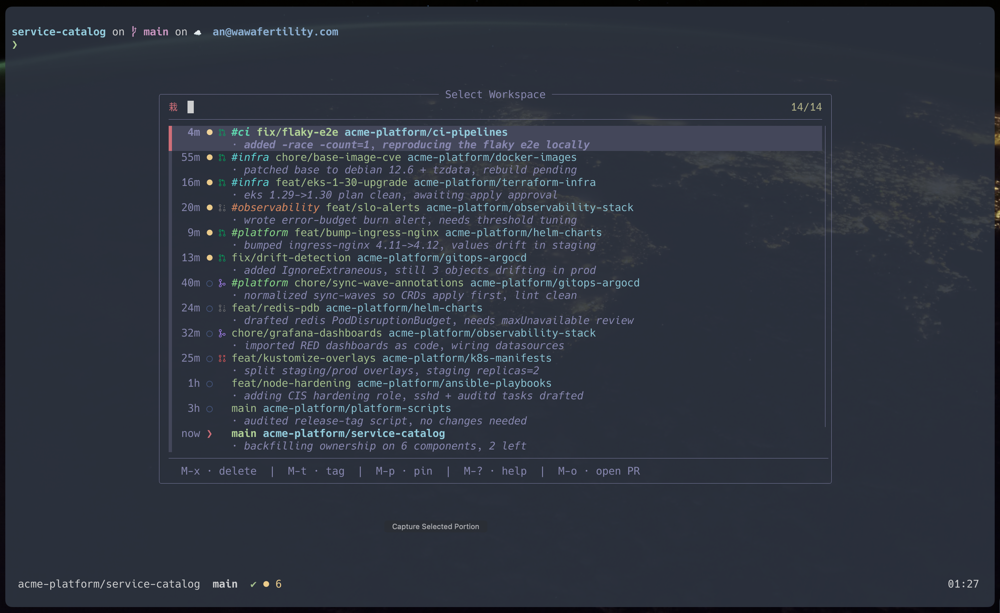

<div align="center">

# atelier

**Intent-first workspaces for running coding agents in parallel.**

You type what you're doing; atelier names the workspace, picks the repos, and
opens the agent. One Go binary, curated built-in tools, an unopinionated
statusline API.

[](https://github.com/vyrwu/atelier/actions/workflows/ci.yml)
[](https://github.com/vyrwu/atelier/releases)
[](LICENSE)



<!-- TODO: replace this splash with a demo video showcasing atelier. -->

</div>

> [!NOTE]
> Alpha, single-author project. Stable for the author's daily use; expect
> rough edges. macOS is the daily-driver platform; Linux builds exist but
> are not exercised as hard.

---

## Overview

atelier lets you run several coding agents (Claude Code, Codex, Aider) in
parallel, organized around what you're *doing* rather than which repo you're in.
You describe a task; atelier spins up a workspace for it and keeps track of which
ones need your attention.

**A workspace is an intent** — one driver agent working at a dedicated directory
(`~/ateliers/<slug>`) that may span several repositories. Instead of picking a
repo, you type the task at hand (`M-n`); atelier names the workspace, selects the
repos the intent touches, creates a git worktree per repo, and symlinks each into
the workspace root as `<repo>/<branch>` — so the agent's `ls` shows the worktrees
in play and it edits through those paths. The agent can grow its own workspace
(add worktrees, register the PRs it opens) through a small CLI / MCP control
surface.

A background loop continuously observes each workspace's driver agent —
re-reading its session transcript to derive a one-line recap and a three-state
status (blocked / running / idle) — sweeps the forge for the workspace's PRs,
rolls it all up into a one-line workspace summary, persists it to disk, and
rehydrates on tmux restart.

## Features

- **Workspace = intent + driver agent + worktrees.** `M-n` creates a workspace
  from a natural-language task (atelier names it and selects the repos), `M-s`
  lists your workspaces one row each, `M-c` reviews changes (PRs) across every
  repo in flight, `M-;` opens any tool for the current workspace.
- **The agent can act on its workspace.** The driver agent grows and reports on
  its own workspace through CLI verbs — `atelier workspace worktree add|list`,
  `atelier workspace context`, `atelier pr register|list|close` — also exposed to
  Claude as MCP tools via a built-in stdio server (`atelier mcp serve`). So the
  agent adds the repos it needs and registers the PRs it opens; atelier tracks
  them in the Changes view.
- **Cross-repo Changes view.** `M-c` aggregates every workspace's pull requests
  into one actionable list — PR number, CI, review decision, comment count — and
  lets you open (`M-o`) or close (`M-c`) a PR from the terminal.
- **Load-bearing kernel, swappable integrations.** The kernel owns the views
  and their capability slots — a per-row AI summary, an attention sigil, a
  code-forge badge. An integration is a bounded adapter that fills a slot.
  Claude is the default AI; GitHub fills the PR badge. Both are selected in
  config, not compiled in.
- **Launchers instead of an SDK.** Register any command with a `[tools.<name>]`
  block; atelier binds a key, opens it in a popup, and owns the window state.
  No Go, no plugin protocol, no recompile.
- **Unopinionated statusline.** atelier emits attention (an agent is blocked
  waiting on you) and the current workspace's description as `#(atelier status …)`
  commands you embed in your own statusline. Works with vanilla tmux, Dracula, or
  Powerline; it supplies data, not visuals.
- **Persistent state.** Workspaces, worktrees, PRs, recap text, and attention
  flags are written through to disk. `M-q` detaches while the server keeps
  running, so background agents survive.
- **Always-on diagnostics.** Every tmux call from every atelier process is
  logged to `~/.cache/atelier/debug.log`. `atelier doctor` reports missing
  dependencies.
- **Introspectable, self-healing state.** atelier keeps one validated model of
  its tmux entity graph — workspaces, their worktrees and PRs, popups, and the
  outer-focus pointer. `atelier state show [--json]` prints the graph plus any invariant
  violations; `atelier reconcile` reports them, and `atelier reconcile --fix`
  repairs the *structural* ones (orphan popups, a stranded outer pointer, a
  leaked hook). It does **not** clear the attention badge — that's a real
  per-workspace signal (`⏺`), cleared by visiting the workspace, not a fault.

## Installation

```bash
brew install vyrwu/tap/atelier
```

The cask pulls in the two hard dependencies, `tmux` and `fzf`. Everything else
(k9s, pgcli, lazygit, gh, granted, node, …) is optional — install only what
the tools you use require. `atelier doctor` reports the gaps.

<details>
<summary>Build from source</summary>

```bash
git clone https://github.com/vyrwu/atelier
cd atelier
make install        # builds and installs to $HOME/.local/bin
```

A Nix dev shell (`nix develop`) pins tmux, go, fzf, jq, yq, golangci-lint, and
goreleaser.

</details>

<details>
<summary>Prebuilt binaries</summary>

Download a tarball for linux/macos × amd64/arm64 from the
[releases page](https://github.com/vyrwu/atelier/releases) and place the
`atelier` binary on your `PATH`.

</details>

## Get started

Add one line to `~/.config/tmux/tmux.conf`:

```tmux
run-shell 'atelier init --bare | tmux source-file -'
```

`--bare` emits engine wiring only — bindings, hooks, and statusline data
emitters — with no theme or format opinions, so an existing dracula / gruvbox /
nord setup is unaffected. This is the author's daily driver; see
[`examples/tmux/vyrwu.conf`](examples/tmux/vyrwu.conf) (dracula + TPM + atelier).

```bash
atelier doctor      # check tmux and every tool's requirements
```

For wiring the attention rollup and workspace description into your statusline
format, see [docs/EMBEDDING.md](docs/EMBEDDING.md).

<details>
<summary>Reference tmux configs</summary>

| File | Description |
|---|---|
| [`examples/tmux/minimal.conf`](examples/tmux/minimal.conf) | atelier on vanilla tmux — no theme, no plugins. The smallest embedding. |
| [`examples/tmux/powerline.conf`](examples/tmux/powerline.conf) | atelier in a powerline-styled tmux; shows how emitters inject into arrow-segment layouts. |
| [`examples/tmux/vyrwu.conf`](examples/tmux/vyrwu.conf) | The author's daily-driver config: dracula + TPM + atelier. |

The only load-bearing line is the `run-shell` above; the rest is taste.

</details>

<details>
<summary>Bundled runtime (no existing tmux setup)</summary>

Run `atelier` with no subcommand to spawn a dedicated tmux server
(`tmux -L atelier`) with curated defaults — system-clipboard yank, 50k
scrollback, focus-events, vi mode, truecolor, fast escape-time. No `tmux.conf`
required.

```bash
atelier
```

Override defaults in `~/.config/atelier/tmux.conf.local` (sourced after every
default). For powerline decoration, start from
[`examples/atelier-extras.tmux`](examples/atelier-extras.tmux) (requires a Nerd
Font).

</details>

## Key bindings

| Keys | Action |
|------|--------|
| `M-;` | Tool selector — fzf list of every discovered tool; picks route to the current workspace. |
| `M-n` | New workspace — type the task; atelier names it, picks the repos, and opens the driver agent. |
| `M-s` | Active workspaces — one row per workspace, with a recap + rollups; `Enter` switches. |
| `M-c` | List Changes — cross-repo PR view; `M-o` opens a PR, `M-c` closes it, `Enter` opens in a browser. |
| `M-k` | Switch k9s context (moved from `M-c`, which is now List Changes). |
| `M-?` | Cheatsheet — every active binding, scoped to the current context. |
| `M-q` | Detach — the server keeps running; reattach with `atelier` (or `tmux -L atelier attach`). |

Inside the **Active workspaces** picker (`M-s`): `M-r` renames the workspace,
`M-x` deletes it (the confirm enumerates the worktrees and PRs that will be
destroyed), `M-t` tags it, `M-p` pins the search scope.

Each popup runs in its own backing tmux session, so opening a tool does not
disturb your work and closing it leaves it ready to resume. `M-;` works inside a
tool's popup, so you can pivot to another tool without closing the first.

> With the bundled launcher, `atelier` opens the `M-n` intent creator on attach
> when you have no workspaces yet, instead of dropping you on a bare shell.

## Configuration

Config is optional — every field has a default, and atelier runs with no config
file at all. There is no scaffold command yet; to override, hand-write
`$XDG_CONFIG_HOME/atelier/config.toml` (`~/.config/atelier/config.toml`). Each
section is loaded independently, so you only include the sections you change.
`~`, `~/…`, and `$VAR` are expanded in path values.

The block below is the complete schema, showing every option at its default:

```toml
# All AI configuration lives under one roof. `provider` selects the adapter;
# everything else is capability-level tuning the active adapter interprets
# (model names + prompts below are Claude values).
[ai]
provider = "claude"   # AI adapter: "claude" | "mock" | "" (disables AI features)
model    = "haiku"    # default model for AI tasks that don't set their own
mcp      = true       # register `atelier mcp serve` into the interactive agent
                      # (worktree/PR/context tools). Background calls never get MCP.

[ai.models]           # per-task model overrides (empty = use `model` above)
naming  = "sonnet"    # model that names workspaces (M-n)
recap   = ""          # model for one-line per-agent recaps (M-s rows); inherits `model`
summary = ""          # model for the workspace rollup summary; inherits `model`

[ai.prompts]          # empty = built-in default
recap     = ""        # override the recap system prompt
workspace = ""        # extra system prompt for the driver agent (workspace layout)
summary   = ""        # override the workspace-rollup summary prompt

[forge]
provider    = ""      # forge/PR adapter: "github" | "mock" | "" (off)
allow_write = true    # allow mutating forge ops (close PR from M-c); false = read-only

[workspaces]
code_root      = "~/code/github"             # repo checkouts the AI picks from at M-n
worktree_root  = "~/code/.worktrees/github"  # where git worktrees are materialized
workspace_root = "~/ateliers"                # per-workspace dirs: <root>/<slug>, worktrees symlink in
auto_tag       = true                        # let the AI suggest a tag at M-n creation

[k8s]
contexts = "~/.config/atelier/k8s/contexts.yaml"  # k9s context definitions
configs  = "~/.config/atelier/k8s/configs.yaml"   # k9s cluster configs

[pg]
contexts = "~/.config/atelier/pg/contexts.yaml"   # postgres endpoint definitions

# [tools.<name>] launcher blocks register arbitrary TUIs in popups —
# see "Extending atelier" for every field.
```

## Extending atelier

Three mechanisms, by what you are adding.

### 1. A launcher (no code)

Register any TUI with a `[tools.<name>]` block. atelier binds the key, opens
the command in a popup of the declared shape, and owns the window state; the
command need not be an atelier binary. Example — k9s authenticated through AWS
SSO first:

```toml
[tools.k9s-aws]
launch       = "granted-k9s"     # REQUIRED — any executable on PATH (a script you wrote)
popup        = "global"          # workspace | global | none  (default: none)
key          = "K"               # optional tmux binding
key_table    = ""                # optional tmux key-table for the binding (default: root)
requires     = ["granted-k9s"]   # atelier doctor checks these
invoke       = "open"            # manifest invoke verb (default: open)
start_cwd    = true              # start in the workspace cwd (default: true iff popup="workspace")
icon         = "胡"
accent_color = "110"             # tmux colour 0–255
title        = "K9s (AWS)"
description  = "k9s with AWS SSO auth"
```

`atelier tools list` shows it, `atelier doctor` checks its `requires`, and `M-;`
lists it in the selector.

### 2. An integration (swap a capability)

To change which component fills a kernel capability — the AI that names
workspaces, summarizes, and raises attention, or the forge behind the PR badge —
write an adapter satisfying the kernel port (`internal/integration`:
`AIIntegration`, `ForgeIntegration`) and select it in config:

```toml
[ai]
provider = "claude"
[forge]
provider = "github"
```

Bundled adapters live in `internal/adapters/{claude,github,mock}`. Adding
`codex` / `gemini` / `gitlab` is a new adapter implementing the same port plus
one line in the composition root (`cmd/atelier/integrations.go`). The kernel
does not change; it drives whatever adapter is installed.

### 3. A built-in tool (a PR)

Tools with pre-launch logic (k8s / eks / pg context and auth pickers) are Go
packages under `internal/tools/<name>` exposing `Manifest` + `AddCommands`,
registered in `internal/tools/all`, and dispatched via `atelier tools <name>`.
See [CONTRIBUTING.md](CONTRIBUTING.md).

## How it works

```
[ workspace = intent, one driver agent at ~/ateliers/<slug> ]
        │
        │  bind c → set @atelier_outer_pane=$5
        │       → display-popup -E 'atelier ai open'
        ▼
[ claude popup session (_atelier_claude_5_3) ]
        │
        │  reads @atelier_outer_pane → knows outer is $5
        │  M-; opens tool selector, which can spawn other tools
        │  on the same outer pane without closing claude
        ▼
[ k8s popup renders on $5, claude popup stays open ]
```

The engine tracks the outer pane in global tmux options. Tools inside popups
read those globals — no parsing of session names, no guessing about ancestry.
Each popup spawns its own `atelier` process (one binary, one process per popup),
so a crash in one tool cannot take down the others. Full architecture in
[DESIGN.md](DESIGN.md).

## Development

```bash
make build           # build the atelier binary into bin/
make test            # unit tests (no tmux required)
make test-e2e        # e2e tests against isolated tmux servers
make test-tmux       # launch a sandboxed tmux server with the current build
```

E2E tests spin up `tmux -L atelier-test-<random>` servers, isolated from your
real tmux; cleanup runs even on panic. Every bug fix and feature lands with
tests. For the release process, see [RELEASING.md](RELEASING.md).

## Prior art

- **[Claude Code](https://github.com/anthropics/claude-code)** — the daily
  driver. Per-task scope, attention signals, and resume-on-restart are the
  workflow patterns atelier is built around.
- **[k9s](https://github.com/derailed/k9s)** — a TUI preferable to most browser
  alternatives; atelier's k8s tool is a thin shell around it.
- **[sesh](https://github.com/joshmedeski/sesh)** — the "binary on PATH, not a
  TPM plugin" model of extending tmux.
- **[lazygit](https://github.com/jesseduffield/lazygit)** — the per-workspace
  git surface, shipped as a `[tools.lazygit]` launcher.
- **[Conductor](https://conductor.build)** — parallel agents in isolated
  workspaces, as a desktop app; atelier takes the same thesis into the terminal.
- **[Neovim](https://github.com/neovim/neovim)** and its distributions — the
  engine-versus-distribution framing: the engine is portable, the bundled
  runtime is a curated layer on top.

## Status

Currently shipping `v0.9.x`; the intent-workspace redesign (this README) lands as
the next major. Known limitations:

- macOS only in practice (Linux builds exist but are not tested daily).
- Requires tmux ≥ 3.4 with `display-popup`.
- Single-author cadence; no SLAs.

## License

MIT — see [LICENSE](LICENSE).
