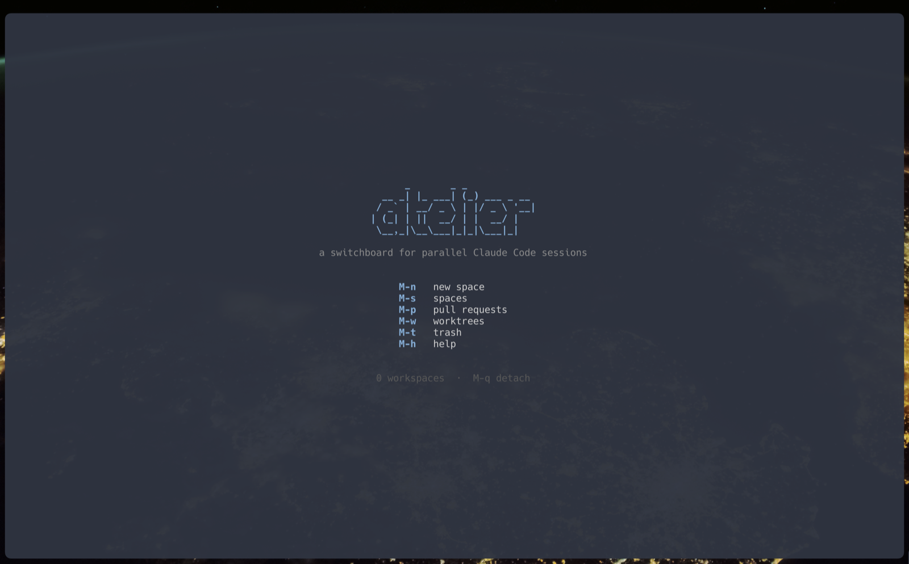

<div align="center">
<pre>
▄▀█ ▀█▀ █▀▀ █   █ █▀▀ █▀█
█▀█  █  ██▄ █▄▄ █ ██▄ █▀▄
</pre>

<h1>atelier</h1>

<p><strong>A workshop for parallel Claude Code agents.</strong></p>

<p>
<a href="https://github.com/vyrwu/atelier/releases"></a>
<a href="https://github.com/vyrwu/atelier/actions/workflows/ci.yml"></a>
<a href="LICENSE"></a>
</p>

<p>
<a href="#install">Install</a> ·
<a href="#quick-start">Quick start</a> ·
<a href="#keys">Keys</a> ·
<a href="#how-it-works">How it works</a> ·
<a href="#configuration">Configuration</a> ·
<a href="#troubleshooting">Troubleshooting</a> ·
<a href="CONTRIBUTING.md">Contributing</a>
</p>
</div>

<p align="center">
  
</p>

---

Running several Claude Code agents at once is powerful, but it's taxing. You
switch contexts constantly, and you're never quite sure which session is working,
which is blocked waiting on you, and which is done.

**atelier makes parallel agents something you *have*, not something you
*manage*.** Describe a task and it becomes a **space**: a named directory with
its own agent, already running in the background before you've read the
confirmation. One keystroke shows every space you have open; a single marker
tells you which agent actually needs you. The pull requests your agents open
come to you, with live CI and review status and a diff you can read without
leaving the terminal.

One binary, running on its own tmux server so it never touches yours.

## Features

- **Start work without breaking focus.** New spaces are built in the background.
  You stay on what you were doing, and a status-line spinner tells you when the
  new one is ready.
- **Know where to look.** An agent waiting on you raises one attention marker,
  and the Spaces list puts it first. Working, idle, and finished agents stay
  quiet.
- **Review without the browser.** The pull-request view groups PRs by repo and
  state, keeps stacked PRs together, and shows each one's base, CI, review, and
  comments. It stays current while it's open. <kbd>Enter</kbd> opens the diff in
  a window, with a GitHub-style file tree if you have
  [diffnav](https://github.com/dlvhdr/diffnav) installed.
- **See why CI failed.** `M-e` opens a PR's runs, jobs, steps, and logs in
  [gh-enhance](https://github.com/dlvhdr/gh-enhance), with search through the
  logs and reruns.
- **Change PR state in place.** Reopen or close from the list;
  the row updates at once and reconciles with GitHub.
- **Worktrees that are never stale.** Agents branch every worktree from the
  freshly fetched default branch, and the worktree view shows how far each has
  drifted.
- **Finish without losing anything.** Retire a space to clear it from your active
  list. Restore it later and the agent picks the conversation back up.
- **Your name on the commits.** Agents commit under your git identity, not the
  machine's default.
- **Light by design.** No daemon and no background polling: agent state is
  pushed by Claude Code's own lifecycle hooks, worktrees are read from disk, and
  PRs come from `gh`.

## Install

### Requirements

| | |
|---|---|
| [tmux](https://github.com/tmux/tmux) 3.2+ | atelier runs its own server on a dedicated socket |
| git | worktrees and diffs |
| [GitHub CLI](https://cli.github.com) (`gh`) | PR status and actions — run `gh auth login` first |
| [Claude Code](https://claude.com/claude-code) (`claude`) | the agent atelier drives |
| A [Nerd Font](https://www.nerdfonts.com) | the PR and worktree views use GitHub's Octicon glyphs |

**Optional:** [diffnav](https://github.com/dlvhdr/diffnav) for a file tree beside
PR diffs, or [delta](https://github.com/dandavison/delta) for highlighted diffs
without one. [gh-enhance](https://github.com/dlvhdr/gh-enhance) for CI logs, either
on your `PATH` or as a gh extension
(`gh extension install dlvhdr/gh-enhance`). A truecolor terminal gets you
full-colour themes.

macOS and Linux.

### Homebrew (macOS)

```sh
brew install --cask vyrwu/tap/atelier
```

### Go

```sh
go install github.com/vyrwu/atelier/cmd/atelier@latest
```

### Prebuilt binary

Download the archive for your OS and architecture from the
[releases page](https://github.com/vyrwu/atelier/releases), extract it, and put
`atelier` on your `PATH`.

### From source

```sh
git clone https://github.com/vyrwu/atelier && cd atelier
make install   # builds ./bin/atelier and links it into ~/.local/bin
```

## Quick start

```sh
atelier install   # once: Claude Code hooks, tmux bindings, the per-space guide
atelier           # start (or re-attach) and land on the splash
```

Run `atelier` from a plain terminal, not from inside another tmux session. Press
**`M-n`**, describe a task, and press <kbd>Enter</kbd>. The space builds in the
background; press **`M-s`** when you want to go to it.

`M-` means <kbd>Alt</kbd> (<kbd>Option</kbd> on a Mac). Your terminal has to send
it as Meta — see [Troubleshooting](#troubleshooting) if nothing happens.

## Keys

### Anywhere

| Key | |
|---|---|
| `M-n` | **New** space: describe the task, it builds in the background |
| `M-s` | **Spaces**: your active set, the ones that need you first |
| `M-p` | **Pull requests** for the current space |
| `M-w` | **Worktrees** for the current space |
| `M-t` | **Trash**: retired spaces, restorable |
| `M-h` | **Home**: back to the splash, which lists every key and checks your dependencies. The space you left keeps running. |

### Inside a space

| Key | |
|---|---|
| `M-a` | the **agent** — respawns and resumes Claude if you exited it |
| `M-c` | a **command line** in the space's directory |
| `M-q` | **detach** from atelier; everything keeps running |

### In the overlays

Type to filter. <kbd>↑</kbd>/<kbd>↓</kbd> (or `^k`/`^j`) to move, <kbd>Esc</kbd>
clears the filter, then closes.

| View | Keys |
|---|---|
| **Spaces** | `↵` open · `M-d` retire to Trash |
| **Trash** | `↵` restore, resuming the conversation · `M-d` delete permanently (asks first) |
| **Pull requests** | `↵` diff · `M-e` checks · `M-b` open on GitHub · `M-o` reopen / mark ready · `M-c` close · `M-y` copy as a Markdown link |
| **Worktrees** | `↵` open a persistent shell in that worktree |
| **New** | `↵` start in the background · `⌥↵` start and switch to it · `^j` newline |

The PR diff opens in a window of the space, named after the PR, so pressing
<kbd>Enter</kbd> again returns to it. With diffnav: `n`/`p` move between files,
`e` toggles the tree, `s` toggles side-by-side, `?` shows the rest, `q` closes.

`M-e` opens the PR's checks the same way, in gh-enhance: runs, jobs, and steps down
the side, the log beside them, `/` to search it, `ctrl+r` to rerun. Without
gh-enhance you get gh's live checks table instead, which has no logs.

Once one is open, flip between the two without going back through the PR view:
**`M-e`** in a PR's diff window shows its checks, and **`M-d`** in its checks
window shows the diff again. Anywhere else both keys go to whatever program has
focus, so Alt-d is still delete-word in your shell.

## How it works

```
your terminal
└── tmux -L atelier               atelier's own server; your tmux is untouched
    ├── home                      the splash: keymap, version, dependency check
    ├── spry-otter                one session per space
    │   ├── claude                the agent
    │   ├── shell                 M-c
    │   ├── atelier-feat-login    a shell per worktree, opened from M-w
    │   ├── pr-atelier-128        a PR diff, opened from M-p
    │   └── ci-atelier-128        its checks, opened from M-p → M-e
    └── …
```

**Spaces.** A space is a directory, `~/ateliers/<slug>/`, and a tmux session. It
gets a memorable handle (`spry-otter`) at once, and Claude gives it a descriptive
title a moment later. Each space's `CLAUDE.md` links to one shared guide, so you
can edit what every agent is told in one place.

**Agent status.** atelier installs guarded hooks into Claude Code's global
settings. They do nothing outside atelier, and inside it they record whether the
agent is working, waiting on you, or idle. The status line and the attention
badge update the moment that changes; nothing is sampled.

**Worktrees.** Agents create worktrees through atelier's MCP server rather than
with raw `git`. `create_worktree` branches off the freshly fetched default branch
and puts the worktree inside the space, where atelier reads it straight from
disk.

**Pull requests.** `create_pr` rebases the branch onto the latest default branch,
pushes, and opens a draft on your behalf. `register_pr` tracks a PR opened any
other way. The PR view asks GitHub for exactly the PRs a space tracks, in one
GraphQL query per refresh. It refreshes when you open it and once a minute while
it stays open; that poll is the only one atelier has, and it ends when you close
the view.

**Diffs.** A PR diff comes from the worktree it was built in, compared against
its base. That's instant, works offline, and has no size limit (GitHub's diff API
refuses PRs past 20,000 lines). A stacked PR is compared against the branch below
it, so you see only its own changes. PRs with no worktree in the space fall back
to `gh pr diff`.

**State.** One JSON file, `$XDG_STATE_HOME/atelier/state.json`, holds the list of
spaces and a cache of PR status. It is an index, never the only record of
anything: worktrees come from disk and PRs from GitHub.

The full design, requirements, and rules are in [V1.md](V1.md).

## Configuration

Everything is optional. `$XDG_CONFIG_HOME/atelier/config.toml`
(`~/.config/atelier/config.toml` by default):

```toml
root         = "~/ateliers"  # where spaces live
socket       = "atelier"     # name of atelier's tmux socket
naming       = true          # let Claude title new spaces
naming_model = "sonnet"      # the model that does it
```

| Environment variable | |
|---|---|
| `ATELIER_ROOT` | overrides `root` |
| `ATELIER_SOCKET` | overrides `socket` |

**What agents are told.** `$XDG_CONFIG_HOME/atelier/WORKSPACE_CLAUDE.md` is the
guide every space links to. `atelier install` writes a default; edit it freely.

**The diff window** uses the first of `diffnav`, `delta`, and `less` it finds, and
leaves how it looks to that tool's own configuration. For diffnav, for example:

```yaml
# ~/.config/diffnav/config.yml
ui:
  hideHeader: true
  sideBySide: false
  theme: monokai_pro
  icons: nerd-fonts-filetype
```

## Troubleshooting

**`M-` keys do nothing.** Your terminal is sending <kbd>Option</kbd> as a
character rather than as Meta.

| Terminal | Setting |
|---|---|
| iTerm2 | Profiles → Keys → Left Option key: **Esc+** |
| Terminal.app | Profiles → Keyboard → **Use Option as Meta key** |
| Ghostty | `macos-option-as-alt = true` |
| kitty | `macos_option_as_alt yes` |
| Alacritty | `option_as_alt = "Both"` |
| WezTerm | works by default with the left Option key |

**Icons show as boxes or blanks.** Set a Nerd Font as your terminal font.

**Colours look flat.** atelier passes 24-bit colour through when the terminal
you start it from sets `COLORTERM=truecolor`. Check `echo $COLORTERM`, then detach
and run `atelier` again.

**A key or view doesn't match this README.** atelier's tmux bindings come from
the binary, and it re-syncs them the first time the new binary runs after an
upgrade — open any overlay once. `atelier install` forces it.

**A PR doesn't appear.** Check `gh auth status`. A PR shows up when its head
branch is a worktree in the space, or when the agent registered it.

**The splash's dependency check** (`M-h`) shows which of git, gh, tmux, and
claude atelier can find, and their versions.

## Development

```sh
make dev        # an isolated instance: own socket, state, config, and root under ~/.atelier-dev
make test       # go test ./...
make dev-clean  # remove the dev instance
golangci-lint run ./...
```

`make dev` never touches your real atelier. Everything lives under
`~/.atelier-dev` and a separate tmux socket, and it runs the freshly built
binary.

Releases are cut by [release-please](https://github.com/googleapis/release-please)
from [Conventional Commits](https://www.conventionalcommits.org). Merging its
release PR tags the version, and goreleaser publishes the binaries and the
Homebrew cask.

See [CONTRIBUTING.md](CONTRIBUTING.md) before opening a pull request.

## License

[MIT](LICENSE) © vyrwu
